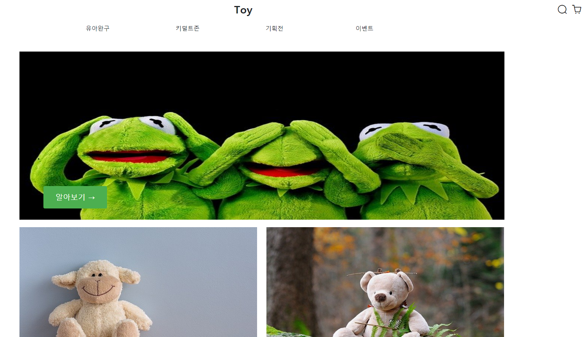

# TOY-SHOP

https://ji55.github.io/toy-shop/

- vue devops 통해 정적 페이지 호스팅하도록 배포
- commit과 push만으로 자동화 할 수 있는 workflow 구성해 actions통해 배포 자동화

## Main Function

- 상품 호버 시, 상품 이름 및 상세 설명 표시

- 새로 등록된 장난감 캐로셀 구현
  - 이전 또는 다음 페이지가 존재하지 않는 경우 방향 아이콘 회색

- 상품 구매 모달 구현
  - 모달 창 외의 부분을 클릭하면 모달 닫힘
  - 플러스, 마이너스 버튼을 통해 구매 개수 증감

- 반응형 구현